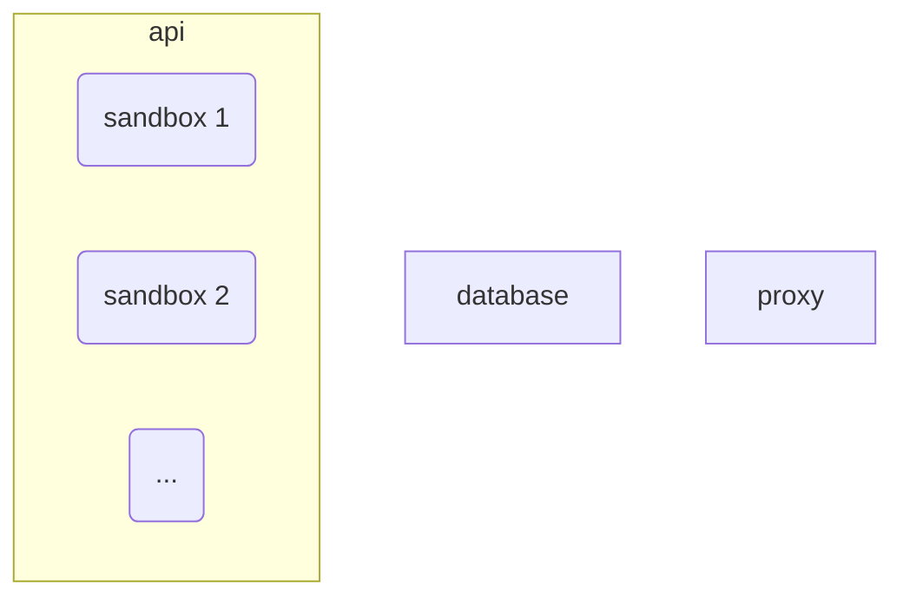
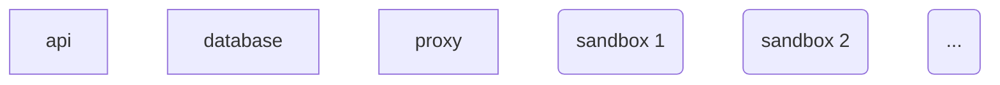

# docleaner
Lots of file types support embedding metadata (such as the author's name) that is invisible to the human eye while merely looking at the document itself. To raise awareness for such potentially privacy-invasive metadata and provide a user-friendly way to remove it, docleaner offers a web service coupled with a REST-like API for users to upload, analyze and clean their own documents. For each document, the service performs the following steps:
* Extract all metadata of the original document
* Transform the original document into a metadata-sparse (*cleaned*) result document. The applied transformation rules are dependent on the document type.
* Extract all metadata of the result document

Both original and resulting metadata as well as the processed metadata-sparse result document are made available to the requestor, who may then decide to merely inspect the found metadata and be done with it or download and use the cleaned result document, e.g. for redistribution or publication. 


## Features
* Processing of potentially dangerous documents within unprivileged isolated [Podman](https://podman.io/) containers (*sandboxes*)
* Parallel processing of multiple documents via Python's [asyncio](https://podman.io/) package
* During analysis, metadata fields may be tagged to indicate the affiliation of a field to a certain feature class. For example, the PDF/UA (Universal Accessibility) indicator implies that a PDF file adheres to the PDF/UA standard and is subsequently tagged with *ACCESSIBILITY*. That way, it's easier for users to reason about the necessity and purpose of certain metadata fields.
* Logic for supported file types is supplied via plugins. Currently, we offer a reference plugin for **PDF** files based on Phil Harvey's [ExifTool](https://exiftool.org/) that preserves fields mandated by various standards such as PDF/A, PDF/E, PDF/UA, PDF/VT and PDF/X, but removes almost everything else - privacy first. Metadata of embedded documents (e.g. EXIF data of embedded pictures) is reported, but NOT removed to avoid invasive modifications of a PDF's content.
* Customizable user-facing frontend built with [htmx](https://htmx.org/) and [Bootstrap](https://getbootstrap.com/)
* REST-like interface with session support to batch-process large amounts of documents
* CLI monitoring and management tool (`docleaner-cli`)
* Issue logging to a remote syslog server (optional)

## Build
The intended and currently only supported mode of deployment is within containers. Therefore, "building" the project will in fact call [Podman](https://podman.io/) multiple times to set up an ephemeral development environment, build a Python wheel and use that to generate a final container image called `docleaner/api:<version>-<theme>`. It also builds all sandbox container images required by plugins and (optional) includes them in the `docleaner/api` image.

Therefore, with having Python 3 and Podman installed, calling
```
$ python3 manage.py build
```
will build all components and put everything required for deployment into a newly created `dist` directory.

Without further arguments, `manage.py` enables the `default` web frontend theme during the build process. To use another theme, provide its name via `-t <theme>`. The selected theme will be reflected in the resulting container image's *tag* field (`docleaner/api:<version>-<theme>`).

Pass `-n` to `manage.py` to embed the container images required for plugins (e.g. for containerized sandboxes) into the final API image. Without that switch, plugin images will still be built and placed in `dist/plugins`.

## Deployment
The docleaner service is intended to be run containerized. Three containers/services are required for a minimal deployment: The docleaner API served via [uvicorn](https://www.uvicorn.org), an HTTP reverse proxy ([nginx](https://nginx.org)) and a database ([MongoDB](https://www.mongodb.com)). On top of that, each job (document) submitted to docleaner will be processed within a newly spawned unprivileged container (sandbox). These ephemeral containers can either be run **nested** within the API container itself or be run **on the host** in parallel to all other containers (both using Podman).

After having built the project with `manage.py build`, the `dist/` directory contains
* the APIs primary container image as `docleaner_api-<version>-<theme>.tar`, which should be loaded with `podman load -i docleaner_api-<version>-<theme>.tar`
* plugin container images in `plugins/`
* `docleaner.conf`: The primary web service configuration file
* example nginx configuration files for setting up plain HTTP (`nginx.insecure.conf`, do **NOT** use in production) and HTTPS (`nginx.tls.conf`) transports
* a Composefile `docker-compose.yml` for usage with [podman-compose](https://github.com/containers/podman-compose) or potentially also Docker Compose (untested, see [Using Podman and Docker  Compose](https://www.redhat.com/sysadmin/podman-docker-compose))

Prior to starting the service, adjust the provided configuration files (see [Configuration](#configuration)). At least set the `DOCLEANER_URL` environment variable in `docker-compose.yml` to the base URL at which the service will be accessible and specify a custom path for the `/data/db` volume of the database container, e.g.
```
volumes:
  - <path/to/data>:/data/db
```
Similarly, if you are offering the service via TLS (highly recommended), mount the TLS certificate and key into the proxy container. The Composefile `docker-compose.yml` includes some examples. Depending on your preferred setup, obey the following instructions to run the sandbox containers either nested within the API container (a) or directly on the host (b). Afterwards, deploy the containers via `podman-compose up -d`.

### Nested sandbox containers (a)


Remember to add the `-n` flag when building the project (`manage.py build -n`). That way, all plugin images will be embedded into the API container image.

Since ideally both the API container and its nested containers should run "rootless" (as a regular user), uid mappings need to be configured in `/etc/subuid` and `/etc/subgid` (see also [How to use Podman inside of a container](https://www.redhat.com/sysadmin/podman-inside-container), specifically the "Rootless Podman in rootless Podman" scenario).

In `docleaner.conf`, make sure that `podman_uri` is set to `unix:///home/podman/nested_podman.sock`, which is an unprivileged Podman system socket that will be created automatically inside the docleaner API container upon startup.

### Sandbox containers on the host (b)


Register all required plugin container images from `dist/plugins/` on the hast via `podman load -i <plugin>.tar`.

To let the docleaner API container manage containers running on the host, a Podman service socket has to be created with `podman system service --time=0 unix://<path/to/podman.sock>` and mounted into the API container as a volume. In `docker-compose.yml`, add a volume mount:
```
volumes:
  - <path/to/podman.sock>:/run/ext_podman.sock
```
In `docleaner.conf`, set `podman_uri` to the socket's mount point within the container, e.g. `unix:///run/ext_podman.sock`.

Refer to our sample [systemd unit](deployment/podman/podman-socket.example.service) to (re-)create the Podman service socket on system startup.

### Purging stale jobs periodically
Users typically interact with docleaner by uploading one or more documents via the web interface or the REST-like API, waiting for processing to finish and finally analyze or download the results. Afterwards, all data associated with these jobs (documents) is no longer needed and should be removed from the server. To assist with that, users can either manually purge jobs with a link present on each job's result page or send a DELETE request to the respective job URL.

Since users will inevitably miss that opportunity and leave their jobs behind, we recommend to periodically run a cron job that purges all *stale* jobs and sessions after a specified amount of time. A  job (document) is considered stale only if it has been processed (status is either SUCCESS or ERROR) and a configurable time threshold has passed. By default, that's 10 minutes. Similarly, a session is considered stale once all of its jobs have been processed and a configurable time threshold has passed (24 hours by default).

The included CLI management tool `docleaner-cli` features a `tasks` command that connects to the database and immediately purges all stale jobs and sessions. The default time threshold can be adjusted with `--job-keepalive <minutes>` and `--session-keepalive <minutes>`. To run that command periodically, register a cron job on the host that invokes `docleaner-ctl` via Podman, e.g.
```
*/5 * * * * user podman exec docleaner_api_1 docleaner-ctl tasks
```

### Management via docleaner-cli
The API container provides a CLI management utility to examine the status of a running deployment or diagnose issues. It can be invoked through Podman, e.g. as `podman exec <api_container_name> docleaner-ctl`. In addition to the aforementioned `tasks` command, the following operations are supported:
* `status` prints a single status line, such as
  ```
  12 jobs in db (C: 0 | Q: 5 | R: 4 | S: 3 | E: 0), 132 total
  --
  total # of jobs currently in the database
                 --------------------------------
                 # of jobs in status CREATED | QUEUED | RUNNING | SUCCESS | ERROR
                                                    ---------
                   total # of jobs processed by this instance
  ``` 
* `diag-err` prints a list of all currently stored jobs with status ERROR. To view details for such a job (given its job id), invoke `diag-err -j <jid>`. Furthermore, to save a job's source document for further analysis, invoke `diag-err -j <jid> --save-src <path>`.
* `diag-run` is similar to `diag-err`, but is used to diagnose running jobs (in case they are stuck in status RUNNING).
* `debug` performs write operations directly on the database and should be used with caution, since it won't sync with the running instance. For example, in case a buggy sandbox instance is stuck in an infinite loop during processing, docleaner could be restarted and `debug -d <jid>` invoked to purge the job's database fragments. Obviously, this should never happen during regular operation.

## Configuration
The docleaner API container recognizes the following environment variables, that can be set in `docker-compose.yml`:
* `DOCLEANER_CONF`: Path to `docleaner.conf` inside the container. By default, that file is mounted into the container at `/etc/docleaner.conf` (via `docker-compose.yml`).
* `DOCLEANER_LOGLVL`: Logging verbosity, defaults to `info`. Logs are always written to stdout and therefore visible in the container's log. If configured (see `log_to_syslog` below), logs can also be sent to an external syslog server.
* `DOCLEANER_URL`: The base URL the service will be served at. Used by the web frontend to construct some URLs.

The service can further be customized via the configuration file `docleaner.conf`. Some general configuration directives go into the `[docleaner]` section:
* `podman_uri` should be set to the path of a Podman system socket that can be used to manage ephemeral sandbox containers. By default, this is set to `unix:///home/podman/nested_podman.sock` to support rootless nested containers.
* `contact`: If set, this string (preferably an E-Mail address) will be shown by the web frontend on the API description page as a contact address in case of issues.
* `log_to_syslog`: If set, forwards log messages to an external syslog server (in addition to sending logs to stdout). Should be specified as `host:<tcp/udp>:port`. Uses Python's [SysLogHandler](https://docs.python.org/3/library/logging.handlers.html#sysloghandler), which at the time this is written only supports unencrypted logging.

The configuration file also contains a section for each plugin that should be loaded during bootstrap, e.g.
```
[plugins.pdf]
sandbox = containerized
containerized.image = localhost/docleaner/plugin_pdf
```
The section name should follow the convention `plugins.<name>`, because that's the Python package `bootstrap()` will try to import during startup. The available configuration options within a plugin's section depend on the specific plugin. We at least recommend and have implemented for the PDF plugin the following two keys:
* `sandbox` denotes the type of sandbox this plugin should use during processing. The supported values depend on the plugin, currently `containerized` is the only possible value. 
* `containerized.image` denotes the name of the container image that should be used to create a new sandbox for this plugin.

## Development
The script `manage.py` supports the creation of an isolated development environment within a bunch of containers. Having Python 3, Podman and [podman-compose](https://github.com/containers/podman-compose) installed on the host system, a dev environment can be set up by calling `manage.py run`. This will build and launch an API container image with various dev scripts and tools, as well as a nginx reverse proxy and a MongoDB database container. Both the API's `src` and `tests` folder are mounted into the dev container so that changes made to the sources on the host system are immediately visible within the container. 

The dev environment launches nested sandbox containers by default (and automatically builds all found plugin images during container startup), but can be instructed to automatically create a Podman system socket on the host (by specifying `-s auto`) instead. Alternatively, you may manually bind a Podman socket from the host system via `-s </path/to/socket>`.

To enter the API dev container, executing `manage.py shell api` launches `/bin/sh` within the `api` container. From there, the following scripts and commands might be useful during development:
* `build_plugin <Containerfile>` (re-)builds a container image for the specified Containerfile, e.g.
  ```
  build_plugin src/docleaner/api/plugins/pdf/sandbox/Containerfile
  ```
* `select_theme` switches between the available frontend themes by changing a few symlinks and invoking *npm* to rebuild static CSS and JS assets (into `api/src/docleaner/api/entrypoints/web/static/dist`).
* `serve_web` launches [uvicorn](https://www.uvicorn.org) to serve both the web frontend and the REST API locally. Make sure to call `select_theme default` (or any other theme) at least once prior to launching the test server. Since the nginx reverse proxy container of the dev environment exposes port 8080 to the host, the test server should then be accessible at [http://localhost:8080](http://localhost:8080).
* `check_style` performs a style check of the codebase with [flake8](https://flake8.pycqa.org/)
* `check_types` type-checks the codebase with [mypy](https://mypy-lang.org/)
* `reformat_code` runs [black](https://github.com/psf/black) to automatically reformat the code
* `pytest` to run *all* unit and integration tests. To only select a subset and get prettier output, try `pytest -svvx tests/unit/`.

To conclude a dev session, `manage.py shutdown` stops and removes all dev containers. To run all checks and tests once, `manage.py test` launches a test environment, performs style and type checks, runs all tests and shuts everything down again.

For more documentation on how code and project are structured, consult our [architecture documentation](docs/architecture.md). If you're interested in supporting more document types by adding a plugin, consult the [plugin documentation](docs/plugins.md).
