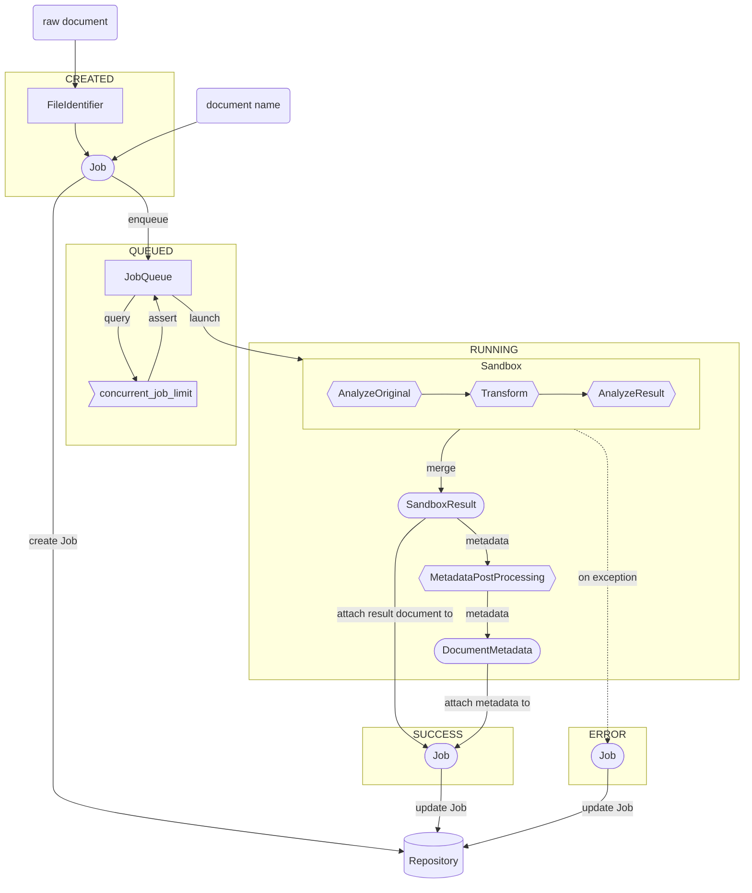

# Architecture
At its core, docleaner receives *Job*s (raw documents plus their name), hands them over to a *FileIdentifier* (to validate the file type is supported) and pushes them to a *JobQueue* that guarantees only a limited number of jobs is processed in parallel, preventing resource exhaustion. Each job will eventually be picked up and executed in a *Sandbox*, which (in the default *ContainerizedSandbox* implementation) launches an unprivileged isolated Podman container and transmits the job's raw document. Within its sandbox, a document is transformed into a metadata-sparse result document and snapshots of its metadata are taken prior and after processing. All generated fragments are then retrieved and consolidated into a *SandboxResult*. After the container exits, all raw metadata returned from the sandbox is handed to a file-type-dependent post-processing function that strips out various metadata fields that aren't likely to contain privacy-sensitive data, annotates various known fields with tags and normalizes the result. The resulting *DocumentMetadata* and cleaned document are then stored within a *Repository* (MongoDB by default).

The following diagram shows the typical flow of data through the system while processing a single job/document. The labels CREATED, QUEUED, RUNNING, SUCCESS and ERROR indicate the job's *state* during processing. Core entities are represented by round nodes and services/handlers by rectangles.

After a Job has been created (`services.jobs.create_job`), its state, source and result documents can be retrieved with the `services.jobs.get_job*` functions. After a job has passed the pipeline (their status is SUCCESS or ERROR), it may be deleted manually with `services.jobs.delete_job`. In addition, jobs become stale after a configurable period of time has passed. Deletion or stale jobs is handled in `services.jobs.purge_jobs`.

To enable batch-processing of large amounts of jobs (e.g. to process multiple files at once), a *Session* can be used as a "job container". It's created with `services.sessions.create_session`, which returns a generated session ID (sid). Given a valid sid, newly created jobs can then be assigned to that session by passing the sid to `services.jobs.create_job`. The `services.sessions` module offers various functions mirroring the ones in `services.jobs` to retrieve, delete or automatically purge all jobs within a session at once.

Newly created jobs and sessions are identified by a randomly generated string (see `utils.generate_token`), which is used to retrieve job and session data after creation. These are meant to be kept secret when using the web frontend or the REST-like API as there is no concept of users or any additional form of authentication. As an additional measure, these identifiers are only valid for a limited amount of time: The aforementioned purge methods are run periodically to remove stale sessions and jobs. Moreover, users can also manually delete their data both via the web frontend and the API.

## Project structure
This Python project follows the [inversion of control](https://en.wikipedia.org/wiki/Inversion_of_control) pattern and is roughly structured as follows (in `api/src/docleaner/api`):
* The **core** package `docleaner.api.core` defines a set of primary dataclasses used throughout the project (such as `Job` , `Session`  or `SandboxResult`) without any non-core dependencies.
* The **services** package `docleaner.api.services` defines various interfaces for adapters to hook into (e.g. an abstract `Repository` class) and functions implementing the actual docleaner use cases by utilizing those interfaces (e.g. `job.create_job` calling a given `Repository` implementation).
* Within the **adapters** package `docleaner.api.adapters` are implementations of the previously mentioned interfaces, e.g. a `MongoDBRepository` implementing the `Repository` interface. This is where third-party dependencies should be imported. Interfaces that depend on external infrastructure or state (such as the presence of a running Database) have an additional dummy implementation used during tests (e.g. `MemoryRepository`).
* The **entrypoints** package `docleaner.api.entrypoints` contains the actual applications used to run or interact with docleaner. Each entrypoint initializes the app via `bootstrap(...)` and then calls the available service functions.
  * **ctl** is a small CLI utility to assess or interfere with a running docleaner instance. It also provides the *purge* command to remove stale jobs and sessions.
  * **web** is a web service built on [FastAPI](https://fastapi.tiangolo.com) that provides both a REST-like API and a web frontend implemented with [htmx](https://htmx.org/) and [Bootstrap](https://getbootstrap.com/). The web frontend has basic theme support, refer to `api/src/docleaner/api/entrypoints/web/themes` for examples.
* Support for specific file/document types is implemented in the form of **plugins**. The **PDF** plugin is a reference implementation featuring a containerized sandbox (refer to `plugins/pdf/sandbox`) and a metadata post-processor (in `metadata.py`). Plugins register their supported file types, sandbox and metadata post-processor via `get_job_types(...)` in `plugins/<name>/__init__.py`.

The remaining folders and files within the repository are structured as follows:
* `api/requirements/`: Python dependencies for development and production, used by pip.
* `api/scripts/`: Various scripts available within the development environment, e.g. to build plugins, perform automated code checks or launch a test server.
* `api/tests/`: Tests, as the name implies.
* `deployment/`: Scaffolding to set up either a containerized development or production environment.
* `manage.py`: Sort of a "Makefile". Automates setup of a local development environment, runs tests or builds a release.
